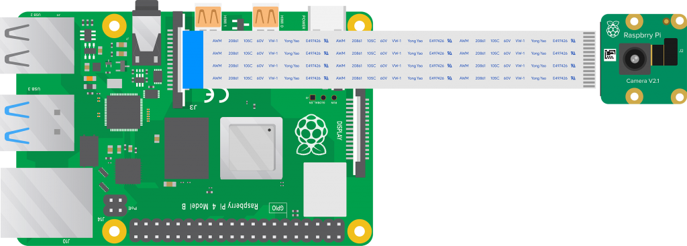

# Batch07

## Building an Intelligent Checkout System: Construction and Item Classification using Deep Learning (CNN)

    

    

        
    

    

        
    

##### Description

The Mechanical and Electrical Construction of an Automated Billing Box Utilizing Computer Vision and Weight Sensing" entails designing a compact square box where users can place items for automated billing. The mechanical construction involves creating a sturdy housing with a platform for item placement and retrieval. Electrical components include weight sensors integrated into the platform to detect items' weight and a camera system for object detection using deep learning computer vision(CNN - Google Teachable Machine). These sensors interface with a microcontroller, such as a Raspberry Pi, to process data and automate the billing process based on detected items and their weights. This innovative solution simplifies transactions by eliminating the need for manual input and streamlining the checkout process.

##### Work Flow

    

##### Schematic

    

        
    

    

        
    

##### Demo

###### connecting to machine

1. Turn on machine by pluging in AC cord
2. Wait for machine to turn on (You can see led turns to red color for 4seconds and turn to orange)
3. Connect to Machine from laptop by searching for Wifi name **Autobillxxxx**, Password is **robotseverywhere**
4.

##### Keywords

##### Resource Links
